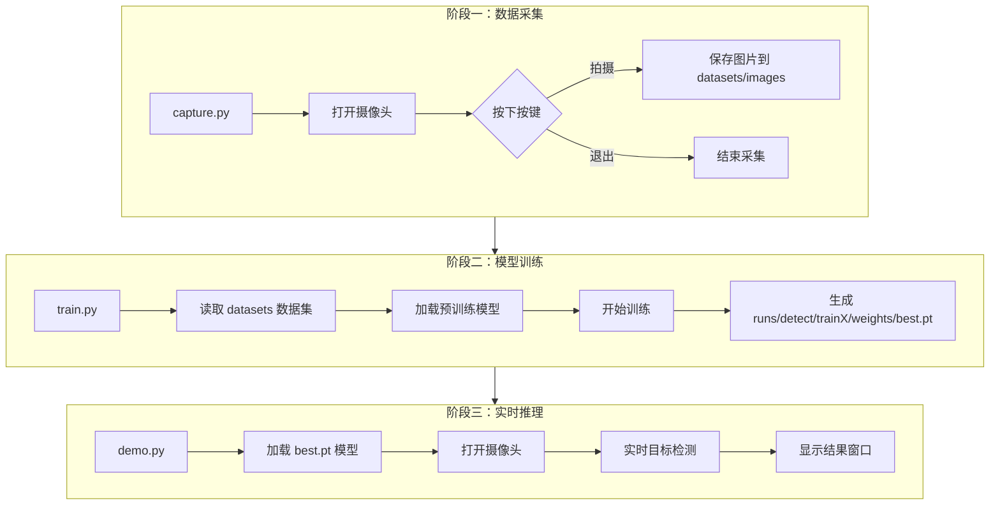

# 工具检测与目标识别系统 (Tool Detection System)

<p>
  <a href="https://www.python.org/"></a>
  <a href="https://docs.ultralytics.com/"></a>
  <a href="https://pytorch.org/"></a>
  <a href="https://opencv.org/"></a>
  <a href="https://www.qt.io/qt-for-python"></a>
  <a href="https://numpy.org/"></a>
</p>

## 📖 项目简介

本项目是一个基于 **Ultralytics YOLOv11** 的完整计算机视觉解决方案，旨在实现特定工具或物体的实时检测与识别。项目涵盖了从 **数据采集**、**环境配置** 到 **模型训练** 和 **实时推理** 的全流程。

主要功能包括：
*   **📸 数据集采集**：通过 GUI 界面调用摄像头，快速采集并保存训练图片。
*   **🔧 环境检测**：自动检测 GPU、CUDA 及 PyTorch 环境配置，确保训练环境可用。
*   **⚡ 模型训练**：基于 YOLOv11 架构，支持自定义数据集进行目标检测模型训练。
*   **🎥 实时推理**：调用本地摄像头，加载训练好的模型进行实时物体检测与标注。

## 🛠️ 技术栈

*   **深度学习框架**: [Ultralytics YOLO](https://docs.ultralytics.com/)
*   **编程语言**: Python 3.x
*   **GUI 库**: PyQt5
*   **图像处理**: OpenCV
*   **硬件加速**: CUDA, cuDNN (可选)

## 📦 安装依赖

在开始之前，请确保您已安装 Python 3.8+。建议创建一个虚拟环境以避免依赖冲突。

### 1. 安装核心库

您可以通过以下 pip 命令安装所有必需的依赖包：
```bash
pip install ultralytics opencv-python pyqt5 torch torchvision torchaudio
```

### 2. 依赖说明

| 库名称 | 用途说明 |
| :--- | :--- |
| `ultralytics` | YOLOv11 模型的核心库，用于模型训练和推理 (`train.py`, `demo.py`) |
| `opencv-python` | 计算机视觉库，用于摄像头捕获和图像处理 (`capture.py`, `demo.py`) |
| `PyQt5` | 用于构建 `capture.py` 中的图形用户界面 (GUI) |
| `torch` | PyTorch 深度学习框架，支持 GPU 加速 (`gpu_check.py`) |

### 3. GPU 环境（可选但推荐）

为了加速模型训练，强烈建议使用 NVIDIA GPU。请确保您的系统已安装：
*   **NVIDIA 驱动**
*   **CUDA Toolkit**
*   **cuDNN**

您可以通过运行以下脚本来验证您的 GPU 环境是否已正确配置：

```bash
python gpu_check.py
```

## 🚀 快速开始

以下示例展示如何运行 `demo.py` 脚本，加载训练好的模型并启动摄像头进行实时目标检测。

### 实时摄像头检测

确保您已经训练好模型（默认路径为 `runs/detect/train8/weights/best.pt`），然后执行以下命令：

```bash
python demo.py
```
运行后，程序会自动尝试打开摄像头。如果摄像头打开成功，将弹出一个名为“工具检测”的窗口，实时显示检测结果。按 **Q** 键退出程序。

**预期输出：**
```
成功打开摄像头，使用后端: 700

实时检测中，按Q键退出...
```
> **注意**：首次运行时，程序会尝试多种摄像头后端（如 `CAP_DSHOW`, `CAP_V4L2`）以确保兼容性。如果您的摄像头索引不是默认的 `0`，请在 `demo.py` 中修改 `backends` 列表。

## 🔄 工作流程

本项目的工作流程遵循标准的深度学习目标检测 pipeline，主要分为三个阶段：**数据采集**、**模型训练** 和 **实时推理**。

1.  **数据采集**：运行 `capture.py`，通过摄像头采集图像并保存到 `datasets` 文件夹下。
2.  **模型训练**：准备好数据集（通常包含 `images` 和 `labels` 子目录）后，运行 `train.py` 进行模型训练。
3.  **实时检测**：训练完成后，使用 `demo.py` 加载生成的权重文件（如 `best.pt`）进行实时摄像头检测。

### 流程图

